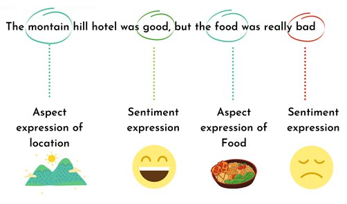

## Vietnamese Aspect-based Sentiment Analysis


### Introduction
Aspect-based sentiment analysis (ABSA) is a text analysis technique that categorizes data by aspect and identifies the sentiment attributed to each one. Aspect-based sentiment analysis can be used to analyze customer feedback by associating specific sentiments with different aspects of a product or service.
<p align='middle'></p>

### Dataset
[UIT-ViSFD](https://github.com/LuongPhan/UIT-ViSFD) is a Vietnamese Smartphone Feedback Dataset as a new benchmark corpus built based on strict annotation schemes for evaluating aspect-based sentiment analysis, consisting of 11,122 human-annotated comments for mobile e-commerce.

### Training and Evaluation
[](https://drive.google.com/drive/folders/1T82zGh7CzrClUGkaXtRrDz4agDP5uMPy?usp=sharing)

### How to use
* Step 1: Automatically install all dependencies from `requirements.txt`.
    ```
    pip install -r requirements.txt
    ```
* Step 2: Configure hyper-parameters in `config.py` and start Streamlit.
    ```
    streamlit run app.py
    ```

### References
[Luong Luc Phan et al. SA2SL: From Aspect-Based Sentiment Analysis to Social Listening System for Business Intelligence. KSEM, 2021.](https://link.springer.com/chapter/10.1007/978-3-030-82147-0_53?fbclid=IwAR00G3h4feqS5m_hu8lMbwLw22bXqOjBLrpBzs25eszMN9d7UPjjaCTEcpw)